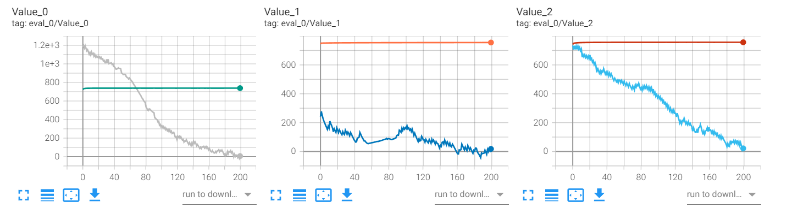
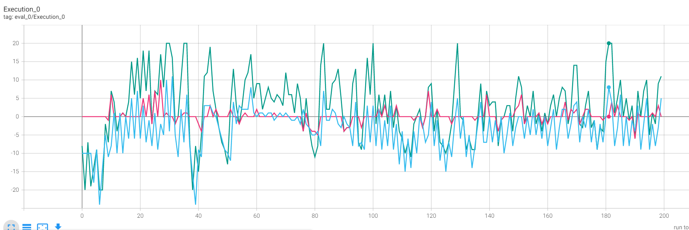
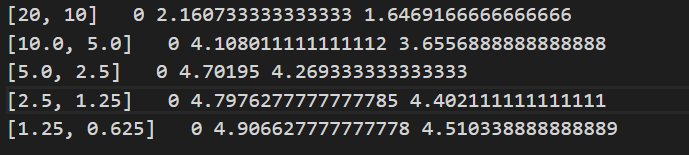
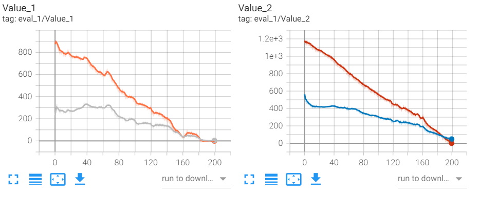
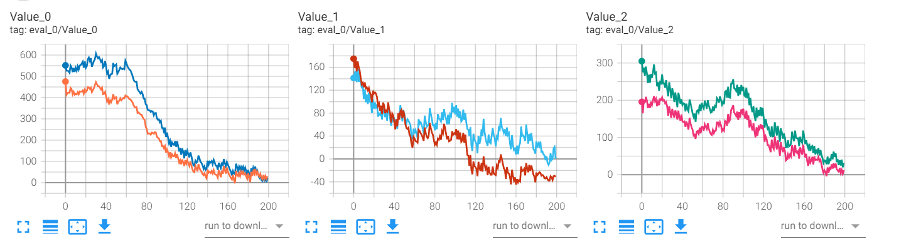
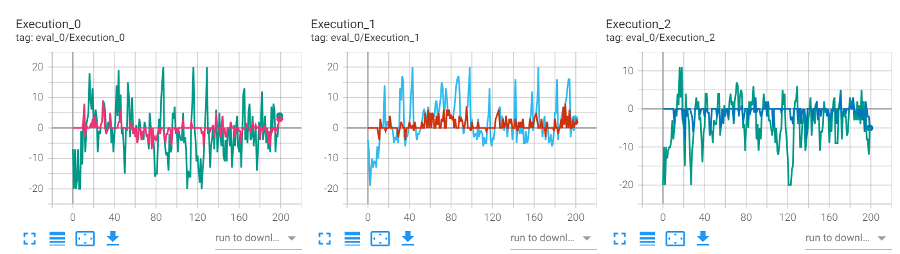
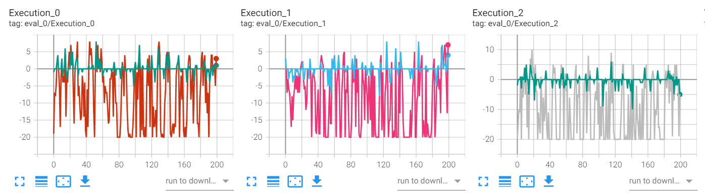

1. 不要value_norm下，预测出来的value都成一条直线了，这也太愚蠢了吧。
   + 不是mse对偏差较大点的敏感导致，因为用了huber_loss,delta设的10。  
   
   + 用了value_norm,虽然不是直线但也很不准
2. 当调高transship中给予方的收益后，确实agent更愿意给出货物，因此transship成交会相对活跃一些
3. 即便是即时信息共享机制下，仍然表现普通，仍不如baseline
   + 即时共享：
   + baseline: eval:5.0542 test:4.5796

# 今日目标
1. 搞清楚value network怎么这么不准
   + gae下的return虽然也无偏，可以作为critic network学习的目标，但当critic network不准时，将严重影响数值的正确性，从而导致critic network学习较慢。可以先用真正的returns学，后面数值稳定了（至少正常了）再用gae的return学
   + 
   + 把tensorboard记录的real_V更正为考虑了衰减的版本
   + 更正后训练好了很多
2. 工程上可以通过config设置转换连续模式与离散模式   这个没做，比较麻烦
3. 睡前跑一个即时信息共享版本的，希望表现比较好   跑起来了，明天看看结果
   + 结果并不好,与前一版好的相比有以下变动：
   + alpha=0.5 》 alpha=0.7
   + transship机制由挨个砍一刀变为了按比例分配
   + 前一版是基于某个已训练的模型，在其基础上迭代；后一版是从头开始训，且lr与clip_bound做了自动的调节
   + 结果eval分数从5.12跌倒4.64
   + transship由正常交易转为非常乐于奉献  》 
   + 改进方式：把transship收益砍成0.1，lr和clip_bound做一定的调整，也用预训练好的模型跑
4. 把按比例分配transship写了
