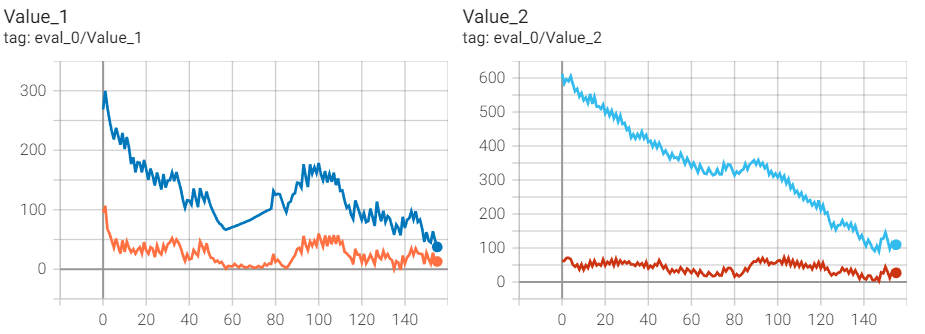

## 思路尝试
1. 在尝试happo时发现，考虑transship训练出来的结果还不如不考虑transship(newsvendor)的训练结果。猜想是action space过大导致的训练困难，故选择了尝试连续版的happo，即policy network最后一层直接输出action均值，而非各个action的概率。
   + 尝试结果：确实更好训练了，transship的训练结果优于no transship，符合实际情况，但仍不如启发式策略，需要考虑其他的方式改进。
   + 感觉这个连续版上限没有happo上限高，连续版虽然网络更容易收敛但相对来说效果没有那么好
   + 或许可以在continue基础上先尝试一些想法，有效果再转到happo上尝试
   + 小trick: policy network对订货量的输出可以加个relu，因为订货量必须大于0；通过std_y_coef渐进式手动调节policy的波动性（调整波动性时，学习率也应作同样的调整，防止学习率过大或过小导致的训练不畅）,以使训练前期充分探索，后期习得相对稳定策略）
   + heuristic: 6.296 no transship:6.237 MADRL: 5.925
   + heuristic: 5.054 no transship:4.495 MADRL: 4.824
2. 因为效果还不如启发式算法， 所以尝试先让policy network接近启发式算法。
   + 思路1：将启发式算法的中间计算变量和observation共同作为网络输入
   + 思路2：先让policy network 学习启发式算法的action，类似多分类的训练
   + 思路3：同2，但直接用happo的框架学
3. 让模型在相对静态的环境训练
   + 需求相对静态：即一个需求sample让模型多跑几遍。一来在同一需求sample下，v的估计会更准从而有助于训练；二来有助于agent之间默契习得transship功能
   + 其他agent相对静态：博弈式训练，就是当训练某一个agent时，固定另外两个agent
4. agent能够在缺货时，发出transship要货的请求，但却较少发出给货的请求，导致transship不怎么成交
   + 尝试增加transship的全局信息，直接用全局信息训练，降低alpha，均未看到明显效果；
   + 可能是agent给予方不能从transship充分受益导致，故考虑通过令transship中给予方获得更大收益
   + 也有可能是transship分配规则的设定导致的
5.  value network 测出来的太不准了，可能并没有什么指导性作用
    + 使得value network输入额外增加T期的所有需求（或其均值与标准差）
## 参数调整
1. n_rollout_threads增大确实对训练稳定性有所帮助
2. 加大hidden_size和网络层数，或者换个网络（应该不会走到这一步）
3. 这个critic network按理说应该拟合的是return，但这里拟合的是gae版本的return，没太看明白其实。然后这个gae还在sample里做了个标准化，说是一个小trick。嗯，再看看。

## 一些对比所需的模型
1. 启发式算法，目前这个可能最多再加一个灵活调度的安全库存
2. 信息共享：每个agent的obs都是所有agent的obs
3. 中心化：由一个policy network控制所有agent的action，因为action space较大，故只能采用连续版去做
4. 滞后的信息共享：每个agent的obs包含过去某个期间的汇总信息（比如，上个星期的销量，订货量，即周末库存情况）

# 训练过程中的体验优化
1. 运用tensorboard，记录训练过程（包括eval的分数变化情况，以及实际执行过程，估计v与实际v的偏差状况） 已完成（但估计v返回的是标准化处理后的结果，需要复原，这个还没完成）
2. 这个eval()目前只支持一个一个串行跑，跑的相当慢，严重拖缓训练进程。改成并行的，参考一下训练的代码